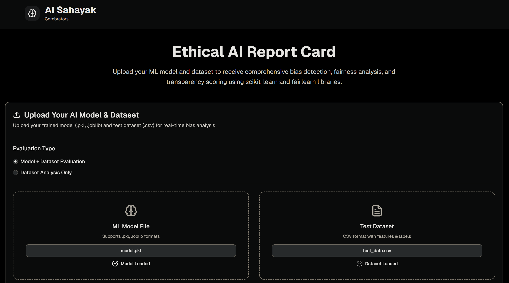
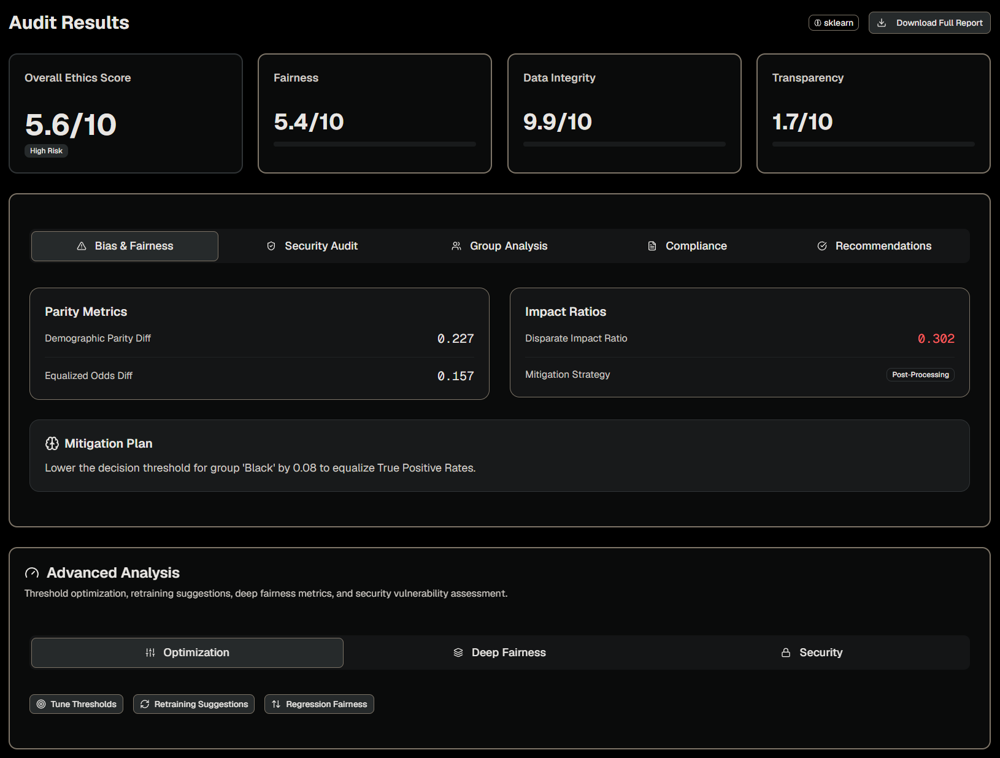

# AI Nivid: Ethical AI Governance Platform

AI Nivid is a Streamlit-based AI governance platform that evaluates machine learning models for bias, fairness, robustness, privacy, and security across multiple ML frameworks.

<div style="display: flex; justify-content: center; gap: 10px;">
  
  
</div>

## Key Features

### Core Ethics Audit
- **Fairness Auditing**: Statistical Parity Difference (SPD), Disparate Impact (DI), Equal Opportunity Difference (EOD), Average Odds Difference (AOD).
- **Security & Robustness**: Gaussian noise stability testing, attribute inference privacy leakage audit.
- **Regulatory Compliance**: Automated alignment with **EU AI Act (Article 10)** and **India's NITI Aayog** principles.
- **Automated Model Cards**: Standardized documentation with Intended Use, Limitations, and Fairness Philosophy.

### Model Optimization
- **Threshold Tuning**: Grid search over decision thresholds (0.05–0.95) to find the optimal tradeoff between SPD and accuracy.
- **Retraining Suggestions**: Feature correlation analysis with the sensitive attribute, biased feature detection, and actionable resampling/reweighting strategies.

### Deep Fairness Metrics
- **Intersectional Analysis**: Audits across combined sensitive attributes to detect compounded bias.
- **Calibration Parity**: Binned calibration analysis examining mean prediction vs. mean actual per group.

### Security & Adversarial Auditing
- **Adversarial Robustness**: Directional ±ε·σ perturbation attack on numerical features.
- **Differential Privacy Audit**: Leave-one-out influence analysis estimating ε-DP guarantees.
- **Membership Inference Attack**: Shadow model training to measure training set membership detectability.

### Multi-Framework Support
- **Framework Auto-Detection**: Automatically identifies **scikit-learn**, **XGBoost**, **PyTorch**, and **TensorFlow/Keras** models.
- **Multi-Format Model Upload**: Supports `.pkl`, `.joblib`, `.json`/`.ubj` (XGBoost), `.pt`/`.pth` (PyTorch), `.h5`/`.keras` (TensorFlow).
- **Unified Prediction Interface**: Single prediction pipeline that adapts to each framework's conventions.
- **Regression Fairness Metrics**: Mean prediction difference and MAE disparity across groups for regression models.

## Usage
1. **Select Audit Scope**: Choose "End-to-End Audit" (Model + Dataset) or "Data-Only Ethics Audit".
2. **Upload Artifacts** (drag-and-drop or click):
   - **Model**: `.pkl`, `.joblib`, `.json`, `.ubj`, `.pt`, `.pth`, `.h5`, `.keras`
   - **Dataset**: `.csv` with target column (`income` or binary target)
3. **Define Sensitive Attribute**: Specify the protected group column (e.g., `sex`, `race`, `age`).
4. **Run Ethics Evaluation**: Multi-pillar audit with fairness, robustness, privacy, and compliance.
5. **Explore Advanced Analysis**:
   - **Optimization** tab: Tune thresholds, get retraining suggestions, regression fairness.
   - **Deep Fairness** tab: Intersectional analysis across multiple attributes, calibration parity.
   - **Security** tab: Adversarial robustness, differential privacy, membership inference.
6. **Download Full Report**: Comprehensive text report covering all audit dimensions.

## How it Works
The platform is built on core AI ethics and machine learning principles:
- **Demographic Parity**: $P(\hat{Y}=1 | G=0) = P(\hat{Y}=1 | G=1)$
- **Disparate Impact**: $\frac{P(\hat{Y}=1 | G=unprivileged)}{P(\hat{Y}=1 | G=privileged)}$ (Applying the 80% rule)
- **Equal Opportunity**: Ensuring $TPR_{unprivileged} = TPR_{privileged}$ through threshold calibration.
- **Intersectional Fairness**: Auditing compounded bias across multiple demographic dimensions.
- **Membership Inference**: Shadow model confidence gap analysis for privacy risk assessment.

## Installation & Setup

```bash
cd AINivid
python -m venv .venv
# Windows:
.venv\Scripts\activate
# macOS/Linux:
# source .venv/bin/activate

pip install -r requirements.txt
```

### Generate Demo Files
```bash
python model.py
```
This trains a LogisticRegression model on the UCI Adult Income dataset and saves `model.pkl` + `test_data.csv`.

### Run the App
```bash
streamlit run app.py
```
Or on Windows, double-click `start.bat`.

The app opens at **http://localhost:8501**.

## Security Notes
- Uploaded files are written to temporary paths and deleted after each audit.
- Model and dataset uploads are capped at **500MB**.
- Only allowlisted model extensions are accepted.
- Deserializing untrusted `.pkl` / `.joblib` / Torch / TF models can execute arbitrary code — only upload models you trust.

---

*Empowering Ethical Machine Learning*
